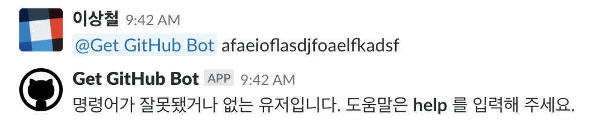
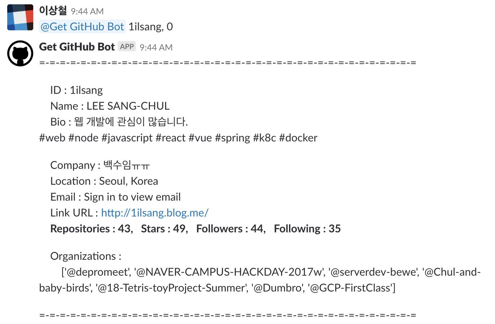
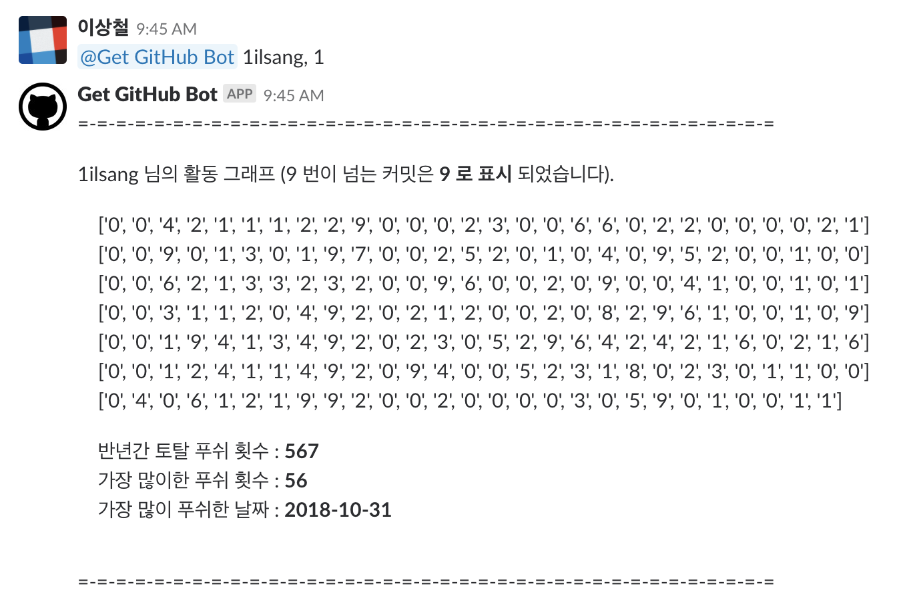
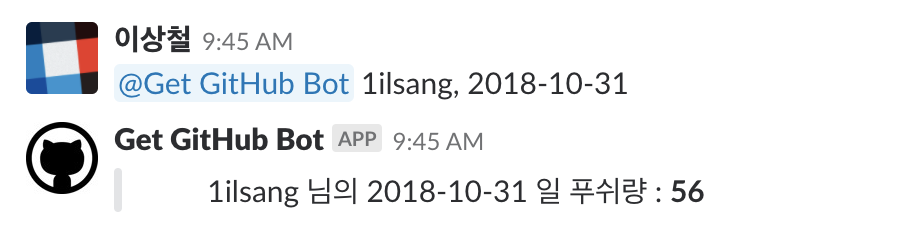

Slack Chatbot
===

#### 간단한 슬랙 챗봇을 만들어 보자.

- ngrok + Slack API + Flask
```
ngrok http 5000
```

### 명령어 목록

#### 1. help 유도

>
#### 2. help

>
#### 3. music

>
#### 4. 아이디, 0

>
#### 5. 아이디, 1

>
#### 6. 아이디, yyyy-mm-dd



#### License

<hr/>

MIT
